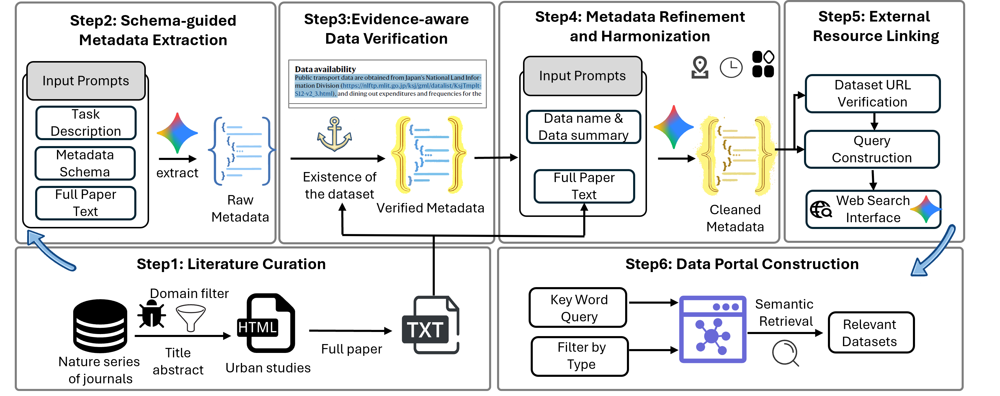

# Paper2Data & UrbanDataMiner

[](https://urbandataminer.github.io/)
[](#) 

Here is the code repo for the paper **"Paper2Data: Large-Scale LLM Extraction and Metadata Structuring of Global Urban Data from Scientific Literature"** (KDD 2026).

Our system uses Large Language Models (LLMs) to automatically identify dataset mentions in scientific papers and structure them using a unified urban data metadata schema. Based on this pipeline, we curate an open urban data discovery portal, **UrbanDataMiner**, which supports dataset-level search and filtering over more than 60,000 urban datasets extracted from over 15,000 Nature-affiliated publications.

🌐 **Try our data portal here:** [https://urbandataminer.github.io/](https://urbandataminer.github.io/)

---

## 🚀 Quick Start: API Usage

In addition to the web portal, you can programmatically access the **UrbanDataMiner** search engine to integrate our curated urban dataset metadata into your own pipelines.

### API Endpoint
`POST https://board-primary-wiring-editing.trycloudflare.com/search`

### 1. Example Request (curl)
To retrieve the top 5 most relevant datasets for a specific query, use the following command:
```bash
curl -X POST [https://board-primary-wiring-editing.trycloudflare.com/search](https://board-primary-wiring-editing.trycloudflare.com/search) \
  -H 'Content-Type: application/json' \
  -d '{
    "query": "air quality monitoring data in New York City",
    "top_k": 5
  }'
```

### 2. Example Request (Python)
We recommend using Python for seamless integration:
```python
import requests

def search_urban_data(query, top_k=5):
    url = "[https://board-primary-wiring-editing.trycloudflare.com/search](https://board-primary-wiring-editing.trycloudflare.com/search)"
    payload = {
        "query": query,
        "top_k": top_k
    }
    response = requests.post(url, json=payload)
    
    if response.status_code == 200:
        return response.json()
    else:
        print(f"Error: {response.status_code}")
        return None

# Example usage
if __name__ == "__main__":
    results = search_urban_data("air quality monitoring data in New York City")
    if results:
        for i, item in enumerate(results, 1):
            print(f"[{i}] Title: {item.get('title')}")
            print(f"    Source: {item.get('url')}\n")
```

---

## 🛠️ Installation & Getting Started

### 1. Requirements
We recommend setting up the environment using the provided files:
```bash
# Using conda (recommended if you have complex dependencies)
conda env create -f environment.yml
conda activate your_env_name

# OR using pip
pip install -r requirements.txt
```

### 2. Running the Extractor
To run the Paper2Data extraction pipeline locally:
```bash
python src/extractor.py \
    --articles-dir "./data/Nature" \
    --base-url "YOUR_API_BASE" \
    --model-name "YOUR_MODEL_NAME" \
    --api-key "YOUR_API_KEY" \
    --threads 4
```

---

## 🏗️ System Architecture

The system architecture is shown as follows:

 

The Paper2Data pipeline consists of six automated steps:
1. **Literature Curation:** Constructing a large-scale corpus of publications.
2. **Schema-guided Metadata Extraction:** Transforming unstructured mentions into structured records using LLMs.
3. **Evidence-aware Data Verification:** Grounding extracted metadata in the original text to mitigate hallucination.
4. **Metadata Refinement and Harmonization:** Standardizing temporal, geographic, and categorical fields.
5. **External Resource Linking:** Retrieving and verifying accessible URLs via a web search API.
6. **Data Portal Construction:** Indexing verified data cards into the UrbanDataMiner portal.

---

## 📝 Citation

If you find this repository or our data portal helpful, please cite our paper:

```bibtex
@inproceedings{you2026paper2data,
  title={Paper2Data: Large-Scale LLM Extraction and Metadata Structuring of Global Urban Data from Scientific Literature},
  author={You, Runwen and others},
  booktitle={Proceedings of the 32nd ACM SIGKDD Conference on Knowledge Discovery and Data Mining (KDD '26)},
  year={2026}
}
```
